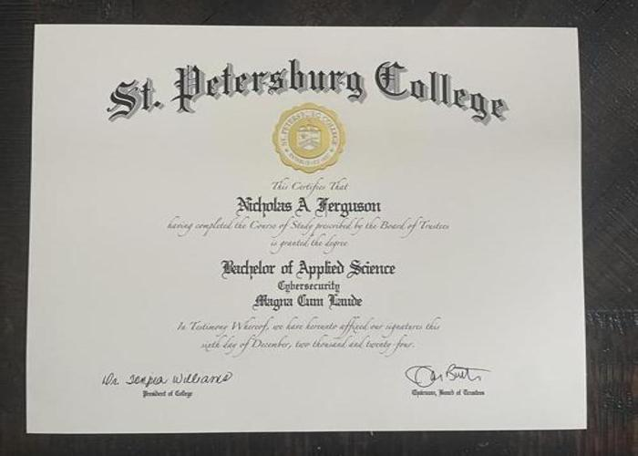

---

### 📌 **CyberGrad: My Cybersecurity Degree in Data & Visuals**
🚀 *A data-driven visualization of my academic journey in cybersecurity, including GPA progression and grade distribution.*



---

## 📚 **Overview**
This repository showcases my **Bachelor of Applied Science in Cybersecurity** through **data analysis and visual storytelling**. Using Python, Pandas, Matplotlib, and Seaborn, I created **insightful visualizations** to track my GPA progression and grade distribution.

The notebook, **CyberGrad--My-Cybersecurity-Degree-in-Data-&-Visuals.ipynb**, presents:
- 📈 **GPA Progression Over Time** – Tracking academic growth.
- 🎓 **Grade Distribution** – Understanding coursework performance.
- 🔥 **Heatmap Analysis** – Exploring grade trends in a different format.
- 📝 **Cybersecurity Degree Image** – Displaying my official degree.

---

## 📊 **Visualizations Included**
| Visualization | Description |
|--------------|------------|
| 📈 **GPA Progression** | Tracks Term GPA & Cumulative GPA over semesters. |
| 📊 **Grade Distribution** | Shows the distribution of grades in various courses. |
| 🔥 **Heatmap of Grades** | Displays grade trends in a heatmap format. |

---

## 🐂 **Repository Structure**
```
📂 SPC-2025-BAS-Cyber-Graduation-Vizs
📁 notebooks/              # Jupyter notebooks
  🏋️‍♂️ CyberGrad--My-Cybersecurity-Degree-in-Data-&-Visuals.ipynb
📁 data/                   # Place your personal CSV files here
📁 sample_data/            # Example CSVs for reference
📁 images/                 # Contains degree image
📁 plots/                  # Saves generated charts
🏋️‍♂️ README.md               # This documentation
🏋️‍♂️ requirements.txt        # Required dependencies
🏋️‍♂️ LICENSE                 # Project license
```

---

## ⚙️ **Installation & Usage**
*Requires **Python 3.11** or later.*
### **1️⃣ Clone the Repository**
```bash
git clone https://github.com/itprodirect/SPC-2025-BAS-Cyber-Graduation-Vizs.git
cd SPC-2025-BAS-Cyber-Graduation-Vizs
```

### **2️⃣ Create a Virtual Environment (Recommended)**
```bash
python -m venv cybergrad_env
source cybergrad_env/bin/activate  # Mac/Linux
cybergrad_env\Scripts\activate     # Windows
```

### **3️⃣ Install Dependencies**
```bash
pip install -r requirements.txt
```

### **4️⃣ Run Jupyter Notebook**
```bash
jupyter notebook
```
- Open **notebooks/CyberGrad--My-Cybersecurity-Degree-in-Data-&-Visuals.ipynb** and execute the cells.

---

## 📊 **Data Used**
The analysis expects CSV files in the `data/` folder (create this directory if it does not exist).  Sample datasets are provided in `sample_data/`:
- **gpa_over_time_sample.csv** – Example term GPA data.
- **course_grades_distribution_sample.csv** – Example course grades.
- **credits_attempted_vs_gpa_sample.csv** – Credits attempted vs cumulative GPA.
- **milestones_sample.csv** – Example milestone events.

You can copy these files into the `data/` folder or replace them with your own data using the same filenames.

---

## 🛠️ **Technologies Used**
- **Python** (Jupyter Notebook)
- **Pandas** for data manipulation
- **Matplotlib & Seaborn** for data visualization
- **PIL (Pillow)** for handling and displaying images

---

## 🔥 **Key Features**
✅ **Dark Mode Charts** – Improved readability & aesthetics.  
✅ **Rotated & Resized Degree Image** – Correctly displayed at the beginning.  
✅ **Heatmap Visualization** – Unique representation of grade patterns.  
✅ **Easy-to-Follow Documentation** – Clearly structured analysis.  


---

## 📝 **License**
This project is licensed under the **MIT License** – feel free to use, modify, and distribute.

---

## 🌟 **Connect & Feedback**
If you found this project useful, consider **starring ⭐ the repo** and connecting with me on **LinkedIn**. Feel free to open an **issue** for feedback or suggestions!

🚀 **Thanks for checking out my cybersecurity journey in data!**

---
